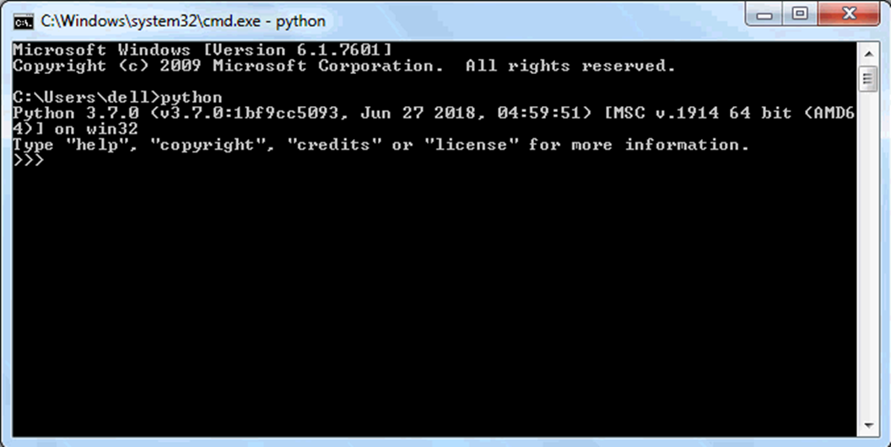

Python - Basic Syntax
=====================

Just like natural languages, a computer programming language comprises
of a set of predefined words which are called keywords. A prescribed
rule of usage for each keyword is called a syntax.

Python 3.x interpreter has 33 keywords defined in it. Since they have a
predefined meaning attached, they cannot be used for any other purpose.
The list of Python keywords can be obtained using the following help
command in Python shell.

::

   >>>help("keywords")

The following table list all the keywords in Python.

======== ======= ======== ======
False    def     if       raise
======== ======= ======== ======
None     del     import   return
True     elif    in       try
and      else    is       while
as       except  lambda   with
assert   finally nonlocal yield
break    for     not
class    from    or
continue global  pass
======== ======= ======== ======

Except for the first three (False, None and True), the other keywords
are entirely in lowercase.

Python Identifiers
------------------

Apart from keywords, a Python program can have variables, functions,
classes, modules, packages etc. Identifier is the name given to these
programming elements. An identifier should start with either an alphabet
letter (lower or upper case) or an underscore (_). After that, more than
one alphabet letters (a-z or A-Z), digits (0-9) or underscores may be
used to form an identifier. No other characters are allowed.

-  Conventionally, the name of the class begins with an uppercase

      alphabet letter. Others start with lowercase alphabet letters.

-  Use of one or two underscore characters has a special significance

      when naming the instance attributes of a class. More about this
      will follow in the discussion about inheritance.

-  Two leading and trailing underscores are used in the language itself
   > for a special purpose. For example (e.g. __add__, \__init__)

Note:

identifiers are case sensitive which means variables
named age and Age are different.

Python Statement
----------------

By default, the Python interpreter treats a piece of text terminated by
hard carriage return (new line character) as one statement. It means
each line in a Python script is a statement. (Just as in C/C++/C#, a
semicolon ; denotes the end of a statement).

Example: Python Statements

.. code:: python

   msg="Hello World"

   code=123

   name="Steve"

However, you can show the text spread over more than one lines to be a
single statement by using the backslash (\\ as a continuation character.
Look at the following examples:

Example: Continuation of Statement

msg=“Hello Pythonista \\

Welcome to Python Tutorial \\

from TutorialsTeacher.com”

Similarly, use the semicolon ; to write multiple statements in a single
line.

Example: Multiple Statements in Single Line

.. code:: python

   msg="Hello World";code=123;name="Steve"

Indents in Python
-----------------

Many times it is required to construct a block of more than one
statements. For example there are usually multiple statements that are
part of the definition of a function. There can be one or more
statements in a looping construct.

Different programming languages use different techniques to define the
scope and extent of a block of statements in constructs like class,
function, conditional and loop. In C, C++, C# or Java, statements inside
curly brackets { and } are treated as a block.

Python uses uniform indentation to denote a block of statements. When a
block is to be started, type the exclamation symbol (**:**) and press
Enter. Any Python-aware editor (like IDLE) goes to the next line leaving
an additional whitespace (called indent). Subsequent statements in the
block follow the same level of indent. In order to signal the end of a
block, the whitespace is de-dented by pressing the backspace key. If
your editor is not configured for Python, you may have to ensure that
the statements in a block have the same indentation level by pressing
the **spacebar** or **Tab** key. The Python interpreter will throw an
error if the indentation level in the block is not same.

To end the block, press Enter two times.

Comments in Python
------------------

In a Python script, the symbol # indicates the start of a comment line.
It is effective till the end of the line in the editor. If # is the
first character of the line, then the entire line is a comment. It can
be used also in the middle of a line. The text before it is a valid
Python expression, while the text following is treated as a comment.

Example: Comments

.. code:: python

   # this is a comment

   print ("Hello World")

   print ("Welcome to Python Tutorial") \#this is also a comment but after
   a statement.

In Python, there is no provision to write multi-line comments, or a
block comment. (As in C#/C/C++, where multiple lines inside /\* .. \*/
are treated as a multi-line comment). Each line should have the # symbol
at the start to be marked as a comment. Many Python IDEs have shortcuts
to mark a block of statements as a comment. In IDLE, select the block
and press Alt + 3.

A triple quoted multi-line string is also treated as a comment if it is
not a docstring of a function or a class. (The use of docstring will be
explained in subsequent tutorials on Python functions.)

Example: Multi-line Comments

.. code:: python

   '''

   comment1

   comment2

   comment3

   '''

   print ("Hello World")

Getting the User’s Input
------------------------

The input() function is a part of the core library of standard Python
distribution. It reads the key strokes as a string object which can be
referred to by a variable having a suitable name.

   taking-users-input

Note that the blinking cursor waits for the user’s input. The user
enters his input and then hits Enter. This will be captured as a string.

In the above example, the input() function takes the user’s input from
the next line, e.g. ‘Steve’ in this case. input() will capture it and
assign it to a name variable. The name variable will display whatever
the user has provided as the input.

The input() function has an optional string parameter that acts as a
prompt for the user.

.. figure:: https://www.tutorialsteacher.com/Content/images/python/input2.gif
   :alt: taking Users Inputs

   taking Users Inputs

The input() function always reads the input as a string, even if
comprises of digits. The type() function used earlier confirms this
behaviour.

::

   >>> name=input("Enter your name: ")
   Enter your name: Steve 
   >>> type(name) 
   <class 'str'\> 
   >>> age=input("Enter your age: ") 
   Enter your age: 21 
   >>> type(age) 
   <class 'str'\>

How do we read numeric data from the keyboard? We have to use other
built-in functions to convert the string to integer/float values. These
functions will be introduced in the `number (Links to an external
site.) <https://www.tutorialsteacher.com/python/python-number-type>`__ chapter.

Display the Output
------------------

Another built-in function print() serves as an output statement in
Python. It echoes the value of any Python expression on the Python
shell.

.. figure:: https://www.tutorialsteacher.com/Content/images/python/print1.gif
   :alt: Display the Output

   Display the Output

Multiple values can be displayed by the single print() function
separated by comma. The following example displays values
of name and age variables using the single print() function.

::

   >>> name="Ram" 
   >>> age=21 
   >>> print("Name:", name, "Age:",age)
   Name: Ram Age: 21

By default, a single space (’ ’) acts as a separator between values.
However, any other character can be used by providing
a **sep** parameter. In the following example, “=” is used as a
separator character.

::

   >>> name="Ram" 
   >>> age=21 
   >>> print(name,age)
   Ram 21 
   >>> print(name,age,sep=",")
   Ram,21

The output of the print() function always ends by a newline character.
The print() function has another optional parameter **end**, whose
default value is “:raw-latex:`\n`”. This value can be substituted by any
other character such as a single space (’ ’) to display the output of
the subsequent print() statement in the same line. This is especially
useful in a Python script like the one shown below:

Example: display.py

.. code:: python

   name="Amar"

   age=21

   print("Name:", name, end=" ")

   print("Age:", age)

Save the above script as display.py and open the command prompt in
Windows or the terminal in another platform, and run the above script as
below.

::

   >>>python display.py Name: Amar Age: 21

Note that the output is displayed in a single line even if there are two
print() statements.
